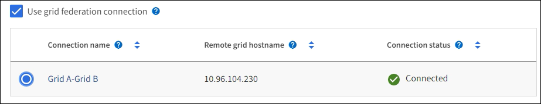

= テナントアカウントを作成します
:allow-uri-read: 
:icons: font
:imagesdir: ../media/

[role="lead"]
StorageGRID システム内のストレージへのアクセスを制御するために、少なくとも 1 つのテナントアカウントを作成する必要があります。

テナントアカウントの作成手順は、かどうかによって異なります link:using-identity-federation.html["アイデンティティフェデレーション"] および link:configuring-sso.html["シングルサインオン"] テナントアカウントの作成に使用する Grid Manager アカウントが、 Root アクセス権限を持つ管理者グループに属しているかどうかが設定されます。

.作業を開始する前に
* を使用して Grid Manager にサインインします link:../admin/web-browser-requirements.html["サポートされている Web ブラウザ"]。
* を使用することができます link:admin-group-permissions.html["rootアクセスまたはテナントアカウントの権限"]。
* Grid Manager 用に設定されているアイデンティティソースをテナントアカウントで使用し、テナントアカウントにフェデレーテッドグループへの root アクセス権限を付与する場合は、そのフェデレーテッドグループを Grid Manager にインポートしておく必要があります。この管理者グループにGrid Manager権限を割り当てる必要はありません。を参照してください  link:managing-admin-groups.html["管理者グループを管理する"]。
* S3テナントがグリッドフェデレーション接続を使用してアカウントデータをクローニングし、バケットオブジェクトを別のグリッドにレプリケートできるようにする場合は、次の手順を実行します。
+
** これで完了です link:grid-federation-create-connection.html["グリッドフェデレーション接続を設定しました"]。
** 接続のステータスは*接続済み*です。
** Root Access 権限が割り当てられている。
** の考慮事項を確認しておきます link:grid-federation-manage-tenants.html["グリッドフェデレーションに許可されたテナントの管理"]。
** テナントアカウントがGrid Manager用に設定されたアイデンティティソースを使用する場合は、両方のグリッドのGrid Managerに同じフェデレーテッドグループをインポートしておく必要があります。
+
テナントを作成するときに、このグループを選択して、ソースとデスティネーションの両方のテナントアカウントに対する初期のRootアクセス権限を割り当てます。

+

TIP: テナントを作成する前にこの管理者グループが両方のグリッドに存在していない場合、テナントはデスティネーションにレプリケートされません。

== ウィザードにアクセスします

.手順
. 「 * tenants * 」を選択します
. 「 * Create * 」を選択します。

== 詳細を入力します

.手順
. テナントの詳細を入力します。
+
[cols="1a,3a"]
|===
| フィールド | 説明 

 a| 
名前
 a| 
テナントアカウントの名前。テナント名は一意である必要はありません。作成されたテナントアカウントには、20桁の一意のアカウントIDが割り当てられます。

 a| 
概要 （オプション）
 a| 
テナントの特定に役立つ概要 。

グリッドフェデレーション接続を使用するテナントを作成する場合は、必要に応じて、このフィールドを使用してソーステナントとデスティネーションテナントを特定します。たとえば、Grid 1に作成されたテナントの概要 は、Grid 2にレプリケートされたテナントの「This tenant was created on Grid 1」にも表示されます。

 a| 
クライアントタイプ
 a| 
このテナントで使用するクライアントプロトコルのタイプ（* S3 *または* Swift *）。

*注*：Swiftクライアントアプリケーションのサポートは廃止され、今後のリリースで削除される予定です。

 a| 
ストレージクォータ（オプション）
 a| 
このテナントにストレージクォータを設定する場合は、クォータとユニットの数値。

|===
. 「 * Continue * 」を選択します。

== [[admin-tenant-select-permissions]]権限を選択

.手順
. 必要に応じて、このテナントに付与する権限を選択します。
+

NOTE: これらの権限の一部には追加の要件があります。詳細については、各権限のヘルプアイコンを選択してください。

+
[cols="1a,3a"]
|===
| アクセス権 | 選択した項目 

 a| 
プラットフォームサービスを許可します
 a| 
テナントでは、CloudMirrorなどのS3プラットフォームサービスを使用できます。を参照してください link:../admin/manage-platform-services-for-tenants.html["S3 テナントアカウントのプラットフォームサービスを管理します"]。

 a| 
独自のアイデンティティソースを使用する
 a| 
テナントでは、フェデレーテッドグループおよびフェデレーテッドユーザの独自のアイデンティティソースを設定および管理できます。がある場合、このオプションは無効になります link:../admin/configuring-sso.html["SSOを設定しました"] をStorageGRID クリックします。

 a| 
S3を許可するを選択します
 a| 
テナントは、オブジェクトデータのフィルタリングと読み出しを行うためのS3 SelectObjectContent API要求を問題 できます。を参照してください link:../admin/manage-s3-select-for-tenant-accounts.html["テナントアカウント用の S3 Select を管理します"]。

*重要*：SelectObjectContent要求を実行すると、すべてのS3クライアントとすべてのテナントのロードバランサのパフォーマンスが低下する可能性があります。この機能は、必要な場合にのみ有効にし、信頼できるテナントに対してのみ有効にします。

 a| 
グリッドフェデレーション接続を使用する
 a| 
テナントはグリッドフェデレーション接続を使用できます。

このオプションの選択：

** このテナント、およびアカウントに追加されたすべてのテナントグループとユーザが、このグリッド（_source grid_）から、選択した接続（_destination grid_）内の他のグリッドにクローニングされます。
** このテナントで、各グリッド上の対応するバケット間のグリッド間レプリケーションを設定できます。

を参照してください link:../admin/grid-federation-manage-tenants.html["グリッドフェデレーションに許可されたテナントを管理します"]。

|===
. [Use grid federation connection]*を選択した場合は、使用可能なグリッドフェデレーション接続のいずれかを選択します。
+

. 「 * Continue * 」を選択します。

== ルートアクセスを定義してテナントを作成

.手順
. StorageGRID システムで使用するアイデンティティフェデレーション、シングルサインオン（SSO）、またはその両方に基づいて、テナントアカウントのルートアクセスを定義します。
+
[cols="1a,2a"]
|===
| オプション | 手順 

 a| 
アイデンティティフェデレーションが有効になっていない場合
 a| 
ローカルrootユーザとしてテナントにサインインするときに使用するパスワードを指定します。

 a| 
アイデンティティフェデレーションが有効になっている場合
 a| 
.. テナントに対するRoot Access権限を割り当てる既存のフェデレーテッドグループを選択します。
.. 必要に応じて、ローカルrootユーザとしてテナントにサインインする際に使用するパスワードを指定します。

 a| 
アイデンティティフェデレーションとシングルサインオン（SSO）の両方が有効になっている場合
 a| 
テナントに対するRoot Access権限を割り当てる既存のフェデレーテッドグループを選択します。ローカルユーザはサインインできません。

|===
. [ テナントの作成 ] を選択します。
+
成功を示すメッセージが表示され、[Tenants]ページに新しいテナントが表示されます。テナントの詳細を表示してテナントアクティビティを監視する方法については、を参照してください link:../monitor/monitoring-tenant-activity.html["テナントのアクティビティを監視する"]。

. テナントに対して*[Use grid federation connection *]権限を選択した場合は、次の手順を実行します。
+
.. 接続内のもう一方のグリッドに同一のテナントがレプリケートされたことを確認します。両方のグリッドのテナントには、同じ20桁のアカウントID、名前、概要 、クォータ、および権限が割り当てられます。
+

NOTE: エラーメッセージ「Tenant created without a clone」が表示される場合は、の手順を参照してください。 link:grid-federation-troubleshoot.html["グリッドフェデレーションエラーをトラブルシューティングする"]。

.. rootアクセスを定義するときにローカルrootユーザのパスワードを指定した場合は、 link:changing-password-for-tenant-local-root-user.html["ローカルrootユーザのパスワードを変更します"] （レプリケートされたテナント）。
+

TIP: ローカルrootユーザは、パスワードが変更されるまで、デスティネーショングリッドでTenant Managerにサインインできません。

== テナントへのサインイン（オプション）

必要に応じて、新しいテナントにサインインして設定を完了するか、あとでテナントにサインインできます。のサインイン手順は、Grid Managerにサインインする際にデフォルトのポート（443）を使用するか制限されたポートを使用するかによって異なります。を参照してください link:controlling-access-through-firewalls.html["外部ファイアウォールでアクセスを制御します"]。

=== 今すぐサインインしてください

[cols="1a,3a"]
|===
| 使用するポート | 手順 

 a| 
ポート443にアクセスし、ローカルrootユーザのパスワードを設定します
 a| 
. [ルートとしてサインイン]*を選択します。
+
サインインすると、バケット、アイデンティティフェデレーション、グループ、およびユーザを設定するためのリンクが表示されます。

. リンクを選択してテナントアカウントを設定します。
+
各リンクをクリックすると、 Tenant Manager の対応するページが開きます。このページの手順については、を参照してください link:../tenant/index.html["テナントアカウントを使用するための手順"]。

 a| 
ポート443およびローカルrootユーザのパスワードを設定していない
 a| 
[サインイン]*を選択し、ルートアクセスフェデレーテッドグループのユーザのクレデンシャルを入力します。

 a| 
制限されたポート
 a| 
. [完了]*を選択します
. このテナントアカウントへのアクセスの詳細を確認するには、[Tenant]テーブルで*[Restricted]*を選択します。
+
Tenant Manager の URL の形式は次のとおりです。

+
`https://_FQDN_or_Admin_Node_IP:port_/?accountId=_20-digit-account-id_/`

+
** `_FQDN_or_Admin_Node_IP_` は、管理ノードの完全修飾ドメイン名またはIPアドレスです
** `_port_` は、テナント専用ポートです
** `_20-digit-account-id_` は、テナントの一意のアカウントIDです

|===

=== 後でサインインします

[cols="1a,3a"]
|===
| 使用するポート | 次のいずれかを実行 ... 

 a| 
ポート443
 a| 
* Grid Manager で * tenants * を選択し、テナント名の右側にある * Sign In * を選択します。
* Web ブラウザにテナントの URL を入力します。
+
`https://_FQDN_or_Admin_Node_IP_/?accountId=_20-digit-account-id_/`

+
** `_FQDN_or_Admin_Node_IP_` は、管理ノードの完全修飾ドメイン名またはIPアドレスです
** `_20-digit-account-id_` は、テナントの一意のアカウントIDです

 a| 
制限されたポート
 a| 
* Grid Manager から * tenants * を選択し、 * Restricted * を選択します。
* Web ブラウザにテナントの URL を入力します。
+
`https://_FQDN_or_Admin_Node_IP:port_/?accountId=_20-digit-account-id_`

+
** `_FQDN_or_Admin_Node_IP_` は、管理ノードの完全修飾ドメイン名またはIPアドレスです
** `_port_` は、テナント専用の制限付きポートです
** `_20-digit-account-id_` は、テナントの一意のアカウントIDです

|===

== テナントを設定します

の手順に従います link:../tenant/index.html["テナントアカウントを使用する"] テナントグループとユーザ、S3アクセスキー、バケット、プラットフォームサービス、アカウントのクローニングとクロスグリッドレプリケーションを管理するため。
