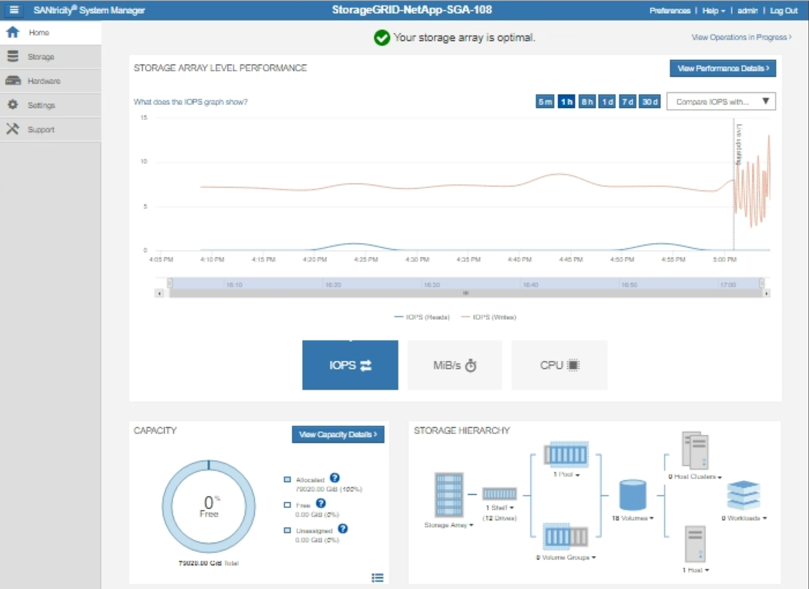

= StorageGRID経由でEシリーズAutoSupportパッケージを送信
:allow-uri-read: 
:icons: font
:imagesdir: ../media/

[role="lead"]
EシリーズSANtricity System Manager AutoSupportパッケージは、ストレージアプライアンスの管理ポートではなく、StorageGRID管理ノード経由でテクニカルサポートに送信できます。

を参照してください https://docs.netapp.com/us-en/e-series-santricity/sm-support/autosupport-feature-overview.html["EシリーズハードウェアAutoSupport"^] EシリーズアプライアンスでのAutoSupport の使用の詳細については、を参照してください。

.作業を開始する前に
* を使用して Grid Manager にサインインします link:../admin/web-browser-requirements.html["サポートされている Web ブラウザ"]。
* を使用することができます link:admin-group-permissions.html["ストレージアプライアンス管理者またはRoot Access権限"]。
* SANtricity AutoSupport が設定されました。
+
** SG6000およびSG5700アプライアンスの場合は、 https://docs.netapp.com/us-en/storagegrid-appliances/installconfig/accessing-and-configuring-santricity-system-manager.html["SANtricity システムマネージャでAutoSupport を設定します"^]

NOTE: Grid Manager を使用して SANtricity System Manager にアクセスするには、 SANtricity ファームウェア 8.70 以降が必要です。

.このタスクについて
EシリーズAutoSupportパッケージには、ストレージハードウェアの詳細が含まれており、StorageGRIDシステムから送信される他のAutoSupportパッケージよりも具体的です。

SANtricity System Managerでは、アプライアンスの管理ポートを使用せずにStorageGRID管理ノード経由でAutoSupportパッケージを送信するように特別なプロキシサーバアドレスを設定できます。この方法で送信されるAutoSupportパッケージは、 link:../primer/what-admin-node-is.html["優先送信者管理ノード"]そして、それらは任意を使用します link:../admin/configuring-admin-proxy-settings.html["管理プロキシの設定"] グリッドマネージャで設定されているデータセンターを選択します。

NOTE: この手順は、EシリーズAutoSupportパッケージ用にStorageGRIDプロキシサーバを設定するためだけに使用します。E シリーズ AutoSupport 構成の詳細については、を参照してください https://mysupport.netapp.com/info/web/ECMP1658252.html["NetApp E シリーズおよび SANtricity に関するドキュメント"^]。

.手順
. Grid Manager で * nodes * を選択します。
. 左側のノードのリストから、設定するストレージアプライアンスノードを選択します。
. SANtricity System Manager* を選択します。
+
SANtricity の System Manager ホームページが表示されます。

+

. サポート * > * サポートセンター * > * AutoSupport * を選択します。
+
AutoSupport operations ページが表示されます。

+
image::../media/autosupport_santricity_operations.png[AutoSupport SANtricity AutoSupport 処理]

. AutoSupport 配信方法の設定 * を選択します。
+
AutoSupport 配信方法の設定ページが表示されます。

+
image::../media/autosupport_configure_delivery_santricity.png[AutoSupport は AutoSupport 配信方法 SANtricity を設定します]

. 配信方法として「 * HTTPS * 」を選択します。
+

NOTE: HTTPSを有効にする証明書が事前にインストールされています。

. プロキシサーバー経由 * を選択します。
. 入力するコマンド `tunnel-host` を入力します。
+
`tunnel-host` は、管理ノードを使用してEシリーズAutoSupportパッケージを送信するための特別なアドレスです。

. 入力するコマンド `10225` をクリックします。
+
`10225` は、アプライアンスのEシリーズコントローラからAutoSupportパッケージを受け取るStorageGRIDプロキシサーバ上のポート番号です。

. AutoSupport プロキシサーバーのルーティングと設定をテストするには、 * テスト構成 * を選択します。
+
正しい場合は、緑色のバナーに「Your AutoSupport configuration has been verified」というメッセージが表示されます。

+
テストに失敗した場合は、赤いバナーが表示されます。StorageGRID DNSの設定とネットワークを確認し、を確認します link:../primer/what-admin-node-is.html["優先送信者管理ノード"] NetApp Support Site に接続して、テストを再試行できます。

. [ 保存（ Save ） ] を選択します。
+
設定が保存され、「AutoSupport配信方法が設定されました」という確認メッセージが表示されます。

