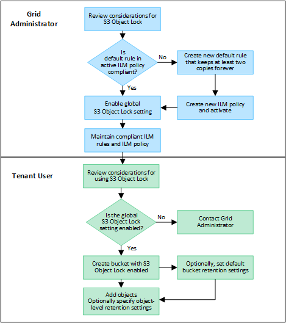

= S3 オブジェクトロックのワークフロー
:allow-uri-read: 
:icons: font
:imagesdir: ../media/

[role="lead"]
グリッド管理者は、テナントユーザと緊密に連携し、保持要件に応じてオブジェクトが保護されるようにする必要があります。

次のワークフロー図は、 S3 オブジェクトロックの使用手順の概要を示しています。以下の手順は、グリッド管理者およびテナントユーザが実行します。

== グリッド管理者のタスク

ワークフロー図に示されているように、 S3 テナントユーザが S3 オブジェクトロックを使用できるようにするには、グリッド管理者が次の 2 つのタスクを実行する必要があります。

. 準拠ILMルールを少なくとも1つ作成し、そのルールをアクティブなILMポリシーのデフォルトルールにします。
. StorageGRID システム全体で、グローバルな S3 オブジェクトロック設定を有効にします。

== テナントユーザタスク

グローバルな S3 オブジェクトのロック設定を有効にしたあと、テナントは次のタスクを実行できます。

. S3 オブジェクトのロックを有効にしたバケットを作成する。
. 必要に応じて、バケットのデフォルトの保持設定を指定します。デフォルトのバケット設定は、独自の保持設定がない新しいオブジェクトにのみ適用されます。
. 対象のバケットにオブジェクトを追加し、必要に応じてオブジェクトレベルの保持期間とリーガルホールドの設定を指定します。
. 必要に応じて、バケットのデフォルトの保持期間を更新するか、個 々 のオブジェクトの保持期間やリーガルホールド設定を更新します。

