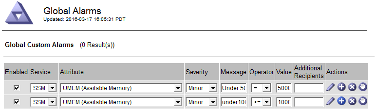

= アラームの管理（従来のシステム）
:allow-uri-read: 
:icons: font
:imagesdir: ../media/

[role="lead"]
StorageGRID アラームシステムは、通常の動作中に発生することがある問題点を特定するために使用される従来のシステムです。

NOTE: 従来のアラームシステムは引き続きサポートされますが、アラートシステムには大きなメリットがあり、使いやすくなっています。

== アラームクラス（レガシーシステム）

レガシーアラームは、相互に排他的な 2 つのアラームクラスのいずれかに属することができます。

* デフォルトアラームはStorageGRID システムごとに用意されており、変更することはできません。ただし、グローバルカスタムアラームを定義して、デフォルトアラームを無効にしたり上書きしたりすることができます。
* グローバルカスタムアラームは、 StorageGRID システムの特定のタイプのサービスすべてのステータスを監視します。グローバルカスタムアラームを作成して、デフォルトアラームを上書きすることができます。新しいグローバルカスタムアラームを作成することもできます。これは、 StorageGRID システムについて独自の状況を監視する場合に役立ちます。

== アラームトリガーロジック（レガシーシステム）

StorageGRID 属性が、あるアラームクラス（デフォルトまたはグローバルカスタム）とアラームの重大度レベルの組み合わせに対して true と評価されるしきい値に達すると、それまでのアラームがトリガーされます。

[cols="1a,1a,1a,3a"]
|===
| をクリックします。 | 色（ Color ） | アラームの重大度 | 意味 

 a| 
image:../media/icon_alarm_yellow_notice.gif["黄色の四角形のアイコン"]
 a| 
黄色
 a| 
注意
 a| 
ノードはグリッドに接続されていますが、正常な状態ではありません。通常の動作に影響はありません。

 a| 
image:../media/icon_alert_yellow_minor.png["薄いオレンジの菱形のアイコン"]
 a| 
薄いオレンジ
 a| 
マイナー
 a| 
ノードはグリッドに接続されていますが、正常な状態ではありません。将来的に動作に影響する可能性があります。さらに重大な問題にならないように調査が必要です。

 a| 
image:../media/icon_alert_orange_major.png["濃いオレンジの菱形のアイコン"]
 a| 
濃いオレンジ
 a| 
メジャー（ Major ）
 a| 
ノードはグリッドに接続されていますが、正常な状態ではありません。すでに動作に影響が及んでいます。エスカレーションを防ぐために早急な対応が必要です。

 a| 
image:../media/icon_alert_red_critical.png["赤の x 印のアイコン"]
 a| 
赤
 a| 
重要
 a| 
ノードはグリッドに接続されていますが、正常な状態ではありません。正常に動作しなくなっています。問題 にはすぐに対処する必要があります。

|===
アラームの重大度と対応するしきい値は、すべての数値属性に設定できます。各管理ノード上の NMS サービスは、設定されたしきい値に照らして現在の属性値を継続的に監視します。アラームがトリガーされると、指定した担当者全員に通知が送信されます。

重大度レベルが「 Normal 」の場合、アラームはトリガーされません。

属性値は、その属性に対して定義されている有効なアラームのリストに照らして評価されます。アラームのリストは次の順序でチェックされ、属性に対して定義された有効なアラームを含む最初のアラームクラスが特定されます。

. アラームの重大度が「 Critical 」から「 Notice 」までのグローバルカスタムアラーム
. アラームの重大度が「 Critical Down 」から「 Notice 」に設定されているデフォルトアラームです。

NMS サービスは、上位のアラームクラスで属性に対する有効なアラームを検出すると、そのクラス内でのみ評価し、NMS サービスは、他の優先順位の低いクラスとは比較しません。つまり、ある属性に対してグローバルカスタムアラームが有効になっている場合、 NMS サービスはグローバルカスタムアラームに対してのみ属性値を評価します。デフォルトアラームは評価されません。したがって、ある属性の有効なデフォルトアラームがアラームのトリガーに必要な条件を満たしていても、同じ属性の（指定した条件を満たさない）グローバルカスタムアラームが有効な場合はトリガーされません。アラームはトリガーされず、通知は送信されません。

=== アラームのトリガー例

次の例を参考に、グローバルカスタムアラームとデフォルトアラームのトリガー方法について理解してください。

次の例では、次の表に示すように、ある属性に対してグローバルカスタムアラームとデフォルトアラームが定義されて有効になっています。

[cols="1a,2a,2a"]
|===
|  | グローバルカスタムアラームしきい値（有効） | デフォルトのアラームしきい値（有効） 

 a| 
注意
 a| 
1500 以上
 a| 
>=1000

 a| 
マイナー
 a| 
15 、 000 以上
 a| 
>=1000

 a| 
メジャー（ Major ）
 a| 
15 、 000 以上
 a| 
>= 25、000

|===
値が 1000 のときにこの属性が評価されると、アラームはトリガーされず、通知は送信されません。

グローバルカスタムアラームはデフォルトアラームより優先されます。1000 という値は、グローバルカスタムアラームのどの重大度レベルのしきい値にも達していません。その結果、アラームレベルは Normal と評価されます。

このシナリオのあとでグローバルカスタムアラームを無効にしても、何も変わりません。新しいアラームレベルがトリガーされるためには、属性値が再評価される必要があります。

グローバルカスタムアラームが無効な状態で属性値が再評価されると、属性値はデフォルトアラームのしきい値に照らして評価されます。その結果 Notice レベルのアラームがトリガーされ、指定した担当者に E メール通知が送信されます。

=== 同じ重大度のアラームです

同じ属性に対する2つのグローバルカスタムアラームの重大度が同じ場合、アラームは優先順位の高い順で評価されます。

たとえば、 UMEM が 50MB に下がった場合、最初のアラーム（ = 50000000 ）はトリガーされますが、その下のアラーム（ \<= 100000000 ）はトリガーされません。

アラームの順序を逆にした場合、 UMEM が 100MB に下がると、最初のアラーム（ \<= 100000000 ）はトリガーされますが、その下のアラーム（ = 50000000 ）はトリガーされません。

image::../media/alarm_order_reversed.gif[グローバルカスタムアラームの例]

=== 通知

通知には、アラームの発生またはサービスの状態の変更が報告されます。アラーム通知は E メールまたは SNMP で送信できます。

あるアラームしきい値に達したときに複数のアラームと通知が送信されないようにするために、アラームの重大度が属性の現在のアラームの重大度に照らしてチェックされます。変更がない場合、それ以上のアクションは実行されません。つまり、 NMS サービスは、システムの監視を継続するにあたり、ある属性のアラーム状態を初めて検出したときにのみアラームを生成して通知を送信します。属性の新しいしきい値に達したことが検出された場合は、アラームの重大度が変わり、新しい通知が送信されます。条件が Normal レベルに戻ると、アラームはクリアされます。

アラーム状態の通知に表示されるトリガー値は、小数点以下 3 桁に四捨五入されます。したがって、 1.9999 の属性値はしきい値が「 2.0 未満」のアラームをトリガーしますが、アラーム通知にはトリガー値が 2.0 と表示されます。

=== 新しいサービス

新しいグリッドノードまたはサイトの追加によって新しいサービスが追加されると、そのサービスにはデフォルトアラームとグローバルカスタムアラームが継承されます。

=== アラームとテーブル

テーブルに表示されるアラーム属性は、システムレベルで無効にすることができます。テーブル内の個 々 の行に対してアラームを無効にすることはできません。

たとえば、次の表に、 Critical レベルの VMFI （ Entries Available ）アラームを 2 つ示します。（ * support * > * Tools * > * Grid topology * を選択します。次に、「 * _ ストレージノード _ * > * SSM * > * リソース * 」を選択します。）

CriticalレベルのVMFIアラームがトリガーされないように、VMFIアラームを無効にすることができます（Criticalレベルのアラームは両方とも緑で表に表示されます）。 ただし、表の行の1つのアラームを無効にして、一方のVMFIアラームがCriticalレベルのアラームとして表示され、もう一方が緑のままになるようにすることはできません。

image::../media/disabling_alarms.gif[重要なアラームが表示されているボリュームページ]

== 現在のアラーム（従来のシステム）に確認応答する

システム属性がアラームのしきい値に達すると、従来のアラームがトリガーされます。レガシーアラームのリストを縮小またはクリアする場合は、アラームを確認することができます。

.作業を開始する前に
* を使用して Grid Manager にサインインする必要があります link:../admin/web-browser-requirements.html["サポートされている Web ブラウザ"]。
* Acknowledge alarms権限が必要です。

.このタスクについて
レガシーアラームシステムは引き続きサポートされるため、新しいアラームが発生するたびに、 Current Alarms ページのレガシーアラームのリストが増加します。通常、アラームは無視してかまいません（アラートによってシステムが見やすくなるため）。また、アラームを確認済みにすることもできます。

NOTE: 必要に応じて、アラートシステムに完全に移行した場合は、各レガシーアラームを無効にして、アラームがトリガーされないようにしたり、レガシーアラームの数に追加されたりしないようにすることができます。

アラームを確認すると、そのアラームはグリッドマネージャの Current Alarms ページに表示されなくなります。ただし、アラームが次の重大度レベルでトリガーされるか、解決されて再び発生する場合は除きます。

NOTE: 従来のアラームシステムは引き続きサポートされますが、アラートシステムには大きなメリットがあり、使いやすくなっています。

.手順
. *support*>* Alarms （レガシー） *>* Current alarms * を選択します。
+
image::../media/current_alarms_page.png[Current Alarms ページ]

. テーブルでサービス名を選択します。
+
選択したサービスの Alarms タブが表示されます（ * support * > * Tools * > * Grid topology * > * _Grid Node_* > * _Service_* > * Alarms * ）。

+
image::../media/alarms_acknowledging.png[アラームの確認応答]

. アラームの*[確認]*チェックボックスを選択し、*[変更の適用]*をクリックします。
+
ダッシュボードまたは[Current Alarms]ページにアラームが表示されなくなります。

+

NOTE: アラームを確認しても、他の管理ノードには通知されません。そのため、別の管理ノードからダッシュボードを表示した場合、アクティブなアラームが引き続き表示されることがあります。

. 必要に応じて、確認済みのアラームを表示します。
+
.. *support*>* Alarms （レガシー） *>* Current alarms * を選択します。
.. 「 * 確認済みアラームを表示」を選択します。
+
確認済みのアラームが表示されます。

+
image::../media/current_alarms_page_show_acknowledged.png[現在のアラームページに確認済みが表示されます]

== デフォルトアラームの表示（従来のシステム）

すべてのデフォルトのレガシーアラームのリストを表示できます。

.作業を開始する前に
* を使用して Grid Manager にサインインする必要があります link:../admin/web-browser-requirements.html["サポートされている Web ブラウザ"]。
* これで完了です link:../admin/admin-group-permissions.html["特定のアクセス権限"]。

NOTE: 従来のアラームシステムは引き続きサポートされますが、アラートシステムには大きなメリットがあり、使いやすくなっています。

.手順
. [*support*>] > [* Alarms (legac)*>] > [* Global alarms] を選択します。
. [ フィルタ条件 ] で、 [ * 属性コード * ] または [ * 属性名 * ] を選択します。
. [等しい]には、アスタリスクを入力します。 `*`
. 矢印をクリックします image:../media/icon_nms_right_arrow.gif["矢印アイコン"] または、 *Enter* キーを押します。
+
すべてのデフォルトアラームが表示されます。

+
image::../media/global_alarms.gif[Global Alarms ページ]

== 過去のアラームとアラーム頻度の確認（従来のシステム）

問題 のトラブルシューティングでは、過去に過去のアラームがトリガーされた頻度を確認できます。

.作業を開始する前に
* を使用して Grid Manager にサインインする必要があります link:../admin/web-browser-requirements.html["サポートされている Web ブラウザ"]。
* これで完了です link:../admin/admin-group-permissions.html["特定のアクセス権限"]。

NOTE: 従来のアラームシステムは引き続きサポートされますが、アラートシステムには大きなメリットがあり、使いやすくなっています。

.手順
. 一定の期間にトリガーされたすべてのアラームのリストを表示する手順は、次のとおりです。
+
.. [*support*>] > [* Alarms (legac)*>] > [* Historical alarms] を選択します。
.. 次のいずれかを実行します。
+
*** いずれかの期間をクリックします。
*** カスタム範囲を入力し、 * カスタムクエリ * をクリックします。

. 特定の属性に対してアラームがトリガーされた頻度を確認するには、次の手順を実行します。
+
.. サポート * > * ツール * > * グリッドトポロジ * を選択します。
.. *_grid node_*>*_service または component_*>* Alarms *>* History * を選択します
.. リストから属性を選択します。
.. 次のいずれかを実行します。
+
*** いずれかの期間をクリックします。
*** カスタム範囲を入力し、 * カスタムクエリ * をクリックします。
+
アラームは新しいものから順番に表示されます。

.. ［ ALARMS HISTORY REQUEST ］ フォームに戻るには、 ［ * 履歴 * ］ をクリックします。

== グローバルカスタムアラームの作成（従来のシステム）

従来のシステムでグローバルカスタムアラームを使用して特定の監視要件に対処している場合があります。グローバルカスタムアラームでは、デフォルトアラームよりも優先されるアラームレベルを設定したり、デフォルトアラームのない属性を監視したりできます。

.作業を開始する前に
* を使用して Grid Manager にサインインする必要があります link:../admin/web-browser-requirements.html["サポートされている Web ブラウザ"]。
* これで完了です link:../admin/admin-group-permissions.html["特定のアクセス権限"]。

NOTE: 従来のアラームシステムは引き続きサポートされますが、アラートシステムには大きなメリットがあり、使いやすくなっています。

グローバルカスタムアラームはデフォルトアラームを上書きします。デフォルトアラームの値は、どうしても必要な場合以外は変更しないでください。デフォルトアラームを変更すると、アラームとなるはずの問題が発覚しなくなる危険があります。

NOTE: アラーム設定を変更する場合は注意してください。たとえば、あるアラームのしきい値を引き上げると、根本的な問題が検出されない可能性があります。アラームの設定を変更する前に、変更案についてテクニカルサポートと検討してください。

.手順
. [*support*>] > [* Alarms (legac)*>] > [* Global alarms] を選択します。
. グローバルカスタムアラームのテーブルに新しい行を追加します。
+
** 新しいアラームを追加するには、 * Edit * をクリックします image:../media/icon_nms_edit.gif["編集アイコン"] （最初のエントリの場合）または * Insert * を入力します image:../media/icon_nms_insert.gif["[ 挿入 ] アイコン"]。
+
image::../media/global_custom_alarms.gif[Global Alarms ページ]

** デフォルトアラームを変更するには、デフォルトアラームを検索します。
+
... [ フィルタ条件 ] で、 [ * 属性コード * ] または [ * 属性名 * ] を選択します。
... 検索文字列を入力します。
+
4 文字を指定するか、ワイルドカードを使用します（例： a ？？？？または AB* ）。アスタリスク（ * ）は複数の文字を表し、疑問符（ ? ）は 単一の文字を表します。

... 矢印をクリックします image:../media/icon_nms_right_arrow.gif["右矢印アイコン"]を押すか、 * Enter * を押します。
... 結果のリストで、 * コピー * をクリックします image:../media/icon_nms_copy.gif["コピーアイコン"] をクリックします。
+
デフォルトアラームがグローバルカスタムアラームのテーブルにコピーされます。

. グローバルカスタムアラームの設定に必要な変更を加えます。
+
[cols="1a,2a"]
|===
| 見出し | 説明 

 a| 
有効
 a| 
このチェックボックスをオンまたはオフにして、アラームを有効または無効にします。

 a| 
属性
 a| 
選択したサービスまたはコンポーネントに該当するすべての属性のリストから、監視対象の属性の名前とコードを選択します。
属性に関する情報を表示するには、 * 情報 * をクリックします image:../media/icon_nms_info.gif["情報アイコン"] をクリックします。

 a| 
重大度
 a| 
アラームのレベルを示すアイコンとテキスト。

 a| 
メッセージ
 a| 
アラームの理由です（例： connection lost 、 storage space below 10% ）。

 a| 
演算子
 a| 
値のしきい値に対して現在の属性値をテストするための演算子：

** = 等しい
** > より大きい
** < より小さい
** >= より大きいか等しい
** \<= 以下
** ≠等しくありません

 a| 
価値
 a| 
アラームのしきい値。演算子を使用して属性の実際の値に対してテストします。
1 つの数値、コロンで指定した数値範囲（ 1 ： 3 ）、または数値と範囲をカンマで区切ったリストを入力できます。

 a| 
受信者の追加
 a| 
アラームがトリガーされたときに通知を受け取る E メールアドレスの追加リストです。これは、 [*Alarms*>*Email Setup*] ページに設定されているメーリングリストに加えて行われます。カンマで区切って指定します。

*注:*メーリングリストを操作するには、SMTPサーバーのセットアップが必要です。メーリングリストを追加する前に、 SMTP が設定されていることを確認してください。
カスタムアラームの通知で、グローバルカスタムアラームまたはデフォルトアラームの通知を上書きすることができます。

 a| 
アクション
 a| 
次の操作を行うためのコントロールボタン    image:../media/icon_nms_edit.gif["編集アイコン"] 行を編集します

[+]
image:../media/icon_nms_insert.gif["[ 挿入 ] アイコン"] 行を挿入します

[+]
 行を削除します

[+]
image:../media/icon_nms_drag_and_drop.gif["アイコンをドラッグします"] 行を上下にドラッグします

[+]
image:../media/icon_nms_copy.gif["コピーアイコン"] 行をコピーします

|===
. [ 変更の適用 *] をクリックします。

== アラームの無効化（従来のシステム）

従来のアラームシステムのアラームはデフォルトで有効になっていますが、不要なアラームは無効にすることができます。新しいアラートシステムに完全に移行したあとに、古いアラームを無効にすることもできます。

NOTE: 従来のアラームシステムは引き続きサポートされますが、アラートシステムには大きなメリットがあり、使いやすくなっています。

=== デフォルトアラームの無効化（レガシーシステム）

システム全体でいずれかの従来のデフォルトアラームを無効にすることができます。

.作業を開始する前に
* を使用して Grid Manager にサインインする必要があります link:../admin/web-browser-requirements.html["サポートされている Web ブラウザ"]。
* これで完了です link:../admin/admin-group-permissions.html["特定のアクセス権限"]。

.このタスクについて
現在アラームがトリガーされている属性のアラームを無効にしても、現在のアラームはクリアされません。次回その属性がアラームのしきい値を超えるとアラームが無効になります。または、トリガーされたアラームをクリアできます。

NOTE: 新しいアラートシステムに完全に移行するまでは、従来のアラームを無効にしないでください。そうしないと、重大な処理を完了できなくなるまで、根本的な問題が検出されない可能性があります。

.手順
. [*support*>] > [* Alarms (legac)*>] > [* Global alarms] を選択します。
. 無効にするデフォルトアラームを検索します。
+
.. [ デフォルトアラーム ] セクションで、 [* フィルタを * > * 属性コード * でフィルタ ] または [ * 属性名 * ] を選択します。
.. 検索文字列を入力します。
+
4 文字を指定するか、ワイルドカードを使用します（例： a ？？？？または AB* ）。アスタリスク（ * ）は複数の文字を表し、疑問符（ ? ）は 単一の文字を表します。

.. 矢印をクリックします image:../media/icon_nms_right_arrow.gif["右矢印アイコン"]を押すか、 * Enter * を押します。

+

NOTE: [*Disabled Defaults] を選択すると、現在無効になっているすべてのデフォルトアラームのリストが表示されます。

. 検索結果リストから、 [ 編集 ] アイコンをクリックします image:../media/icon_nms_edit.gif["編集アイコン"] をクリックします。
+
image::../media/disable_default_alarm_global.gif[Global Alarms ページ]

+
選択したアラームの* Enabled *チェックボックスがアクティブになります。

. [有効]チェックボックスをオフにします。
. [ 変更の適用 *] をクリックします。
+
デフォルトアラームは無効です。

=== グローバルカスタムアラームの無効化（従来のシステム）

システム全体で従来のグローバルカスタムアラームを無効にすることができます。

.作業を開始する前に
* を使用して Grid Manager にサインインする必要があります link:../admin/web-browser-requirements.html["サポートされている Web ブラウザ"]。
* これで完了です link:../admin/admin-group-permissions.html["特定のアクセス権限"]。

.このタスクについて
現在アラームがトリガーされている属性のアラームを無効にしても、現在のアラームはクリアされません。次回その属性がアラームのしきい値を超えるとアラームが無効になります。または、トリガーされたアラームをクリアできます。

.手順
. [*support*>] > [* Alarms (legac)*>] > [* Global alarms] を選択します。
. Global Custom Alarms テーブルで、 * Edit * をクリックします image:../media/icon_nms_edit.gif["編集アイコン"] をクリックします。
. [有効]チェックボックスをオフにします。
+
image::../media/disable_global_custom_alarm.gif[Global Alarms ページ]

. [ 変更の適用 *] をクリックします。
+
グローバルカスタムアラームは無効になっています。

=== トリガーされたアラームのクリア（従来のシステム）

古いアラームがトリガーされた場合は、確認せずにクリアできます。

.作業を開始する前に
* を用意しておく必要があります ``Passwords.txt`` ファイル。

現在アラームがトリガーされている属性のアラームを無効にしても、アラームはクリアされません。このアラームは、属性が変わったときに無効になります。アラームを確認することも、属性値の変化（アラームの状態の変化）を待たずにアラームをすぐにクリアしたい場合は、トリガーされたアラームをクリアできます。これは、値があまり変化しない属性（状態属性など）に対してアラームをすぐにクリアしたい場合に便利です。

. アラームを無効にします。
. プライマリ管理ノードにログインします。
+
.. 次のコマンドを入力します。 `_ssh admin@primary_Admin_Node_IP_`
.. に記載されているパスワードを入力します ``Passwords.txt`` ファイル。
.. 次のコマンドを入力してrootに切り替えます。 `su -`
.. に記載されているパスワードを入力します `Passwords.txt` ファイル。
+
rootとしてログインすると、プロンプトがから変わります `$` 終了： `#`。

. NMSサービスを再開します。 `service nms restart`
. 管理ノードからログアウトします。 `exit`
+
アラームが解除されます。

== アラームの通知の設定（従来のシステム）

StorageGRID システムでは、 E メールとを自動的に送信できます link:using-snmp-monitoring.html["SNMP 通知"] アラームがトリガーされるか、サービスの状態が変わったとき。

デフォルトでは、アラームのEメール通知は送信されません。E メール通知の場合は、 E メールサーバを設定し、 E メール受信者を指定する必要があります。SNMP 通知の場合は、 SNMP エージェントを設定する必要があります。

=== アラーム通知のタイプ（従来のシステム）

レガシーアラームがトリガーされると、 StorageGRID システムは重大度レベルとサービス状態の 2 種類のアラーム通知を送信します。

==== 重大度レベルの通知

選択した重大度レベルのレガシーアラームがトリガーされると、アラーム E メール通知が送信されます。

* 注意
* マイナー
* メジャー（ Major ）
* 重要

メーリングリストは、選択した重大度のアラームに関連するすべての通知を受信します。また、アラームが解決されたか、別の重大度レベルになったことによって、アラームレベルが解除されたときにも通知が送信されます。

==== サービス状態の通知

サービス状態の通知は、サービス（ LDR サービスや NMS サービスなど）が選択したサービス状態になったとき、および選択したサービス状態でなくなったときに送信されます。サービス状態通知は、サービスが次のサービス状態になったとき、またはその状態になったときに送信されます。

* 不明です
* 意図的な停止

メーリングリストは、選択した状態の変更に関連するすべての通知を受信します。

=== アラーム用 E メールサーバの設定（従来型システム）

従来のアラームがトリガーされたときに StorageGRID から E メール通知を送信するには、 SMTP メールサーバ設定を指定する必要があります。StorageGRID システムは電子メールのみを送信し、電子メールを受信することはできません。

.作業を開始する前に
* を使用して Grid Manager にサインインする必要があります link:../admin/web-browser-requirements.html["サポートされている Web ブラウザ"]。
* これで完了です link:../admin/admin-group-permissions.html["特定のアクセス権限"]。

.このタスクについて
以下の設定を使用して、従来のアラーム E メール通知と AutoSupport E メールメッセージに使用する SMTP サーバを定義します。これらの設定は、アラート通知には使用されません。

NOTE: AutoSupportパッケージのプロトコルとしてSMTPを使用する場合は、すでにSMTPメールサーバが設定されている可能性があります。アラームの E メール通知には同じ SMTP サーバが使用されるため、この手順 はスキップしてかまいません。を参照してください link:../admin/index.html["StorageGRID の管理手順"]。

SMTP は、 E メールの送信用にサポートされている唯一のプロトコルです。

.手順
. *support*>* Alarms （レガシー） *>* Legacy email setup* を選択します。
. [ 電子メール ] メニューから、 [*Server* ] を選択します。
+
[Email Server] ページが表示されます。このページは、AutoSupportパッケージ用のEメールサーバの設定にも使用されます。

+
image::../media/email_server_settings.png[E メールサーバの設定]

. 次の SMTP メールサーバ設定を追加します。
+
[cols="1a,2a"]
|===
| 項目 | 説明 

 a| 
メールサーバ
 a| 
SMTP メールサーバの IP アドレス。以前に管理ノードで DNS を設定している場合は、 IP アドレスではなくホスト名を入力できます。

 a| 
ポート
 a| 
SMTP メールサーバにアクセスするためのポート番号。

 a| 
認証
 a| 
SMTP メールサーバの認証を許可します。デフォルトでは、認証はオフです。

 a| 
認証クレデンシャル
 a| 
SMTP メールサーバのユーザ名とパスワード。認証がオンに設定されている場合は、 SMTP メールサーバにアクセスするためのユーザ名とパスワードを指定する必要があります。

|===
. [ 送信元アドレス * ] に、 SMTP サーバーが送信元電子メールアドレスとして認識する有効な電子メールアドレスを入力します。これは、 E メールメッセージの送信元となる公式な E メールアドレスです。
. 必要に応じて、テスト用 E メールを送信して SMTP メールサーバの設定が正しいことを確認します。
+
.. [ 電子メールのテスト *>* 宛先 *] ボックスに、アクセスできるアドレスを 1 つ以上追加します。
+
1 つの E メールアドレスまたは E メールアドレスのカンマ区切りのリストを入力できます。テスト用 E メールを送信しても NMS サービスでは成功したかどうかが確認されないため、テスト受信者の受信ボックスを確認できる必要があります。

.. [ テスト電子メールの送信 *] を選択します。

. [ 変更の適用 *] をクリックします。
+
SMTP メールサーバの設定が保存されます。テスト用 E メールの情報を入力した場合は、その E メールが送信されます。テストメールはすぐにメールサーバに送信され、通知キューからは送信されません。複数の管理ノードがあるシステムでは、各管理ノードから E メールが送信されます。テスト用 E メールが届けば、 SMTP メールサーバの設定は正しく、 NMS サービスはメールサーバに正常に接続しています。NMS サービスとメールサーバの接続に問題がある場合は、 Minor 重大度レベルの Legacy MINS （ NMS Notification Status ）アラームがトリガーされます。

=== アラーム E メールテンプレートの作成（従来のシステム）

E メールテンプレートを使用して、従来のアラーム E メール通知のヘッダー、フッター、および件名をカスタマイズできます。E メールテンプレートを使用すると、本文に同じ内容を含む一意の通知をさまざまなメーリングリストに送信できます。

.作業を開始する前に
* を使用して Grid Manager にサインインする必要があります link:../admin/web-browser-requirements.html["サポートされている Web ブラウザ"]。
* これで完了です link:../admin/admin-group-permissions.html["特定のアクセス権限"]。

.このタスクについて
以下の設定を使用して、従来のアラーム通知に使用する E メールテンプレートを定義します。これらの設定は、アラート通知には使用されません。

メーリングリストごとに異なる連絡先情報が必要になる場合があります。テンプレートには、メールメッセージの本文は含まれません。

.手順
. *support*>* Alarms （レガシー） *>* Legacy email setup* を選択します。
. [ 電子メール ] メニューから、 [*Templates*] を選択します。
. [ 編集（ Edit ） ] をクリックします。 image:../media/icon_nms_edit.gif["編集アイコン"] （または * Insert * ） image:../media/icon_nms_insert.gif["[ 挿入 ] アイコン"] 最初のテンプレートではない場合）をクリックします。
+
image::../media/edit_email_templates.gif[[ 電子メールテンプレート ] ページ]

. 新しい行に次の項目を追加します。
+
[cols="1a,2a"]
|===
| 項目 | 説明 

 a| 
テンプレート名
 a| 
テンプレートの識別に使用する一意の名前。テンプレート名は重複できません。

 a| 
件名の接頭辞
 a| 
任意。E メールの件名の先頭に表示されるプレフィックスです。プレフィックスを使用すると、メールフィルタを簡単に設定し、通知を整理できます。

 a| 
ヘッダー
 a| 
任意。メール本文の先頭に表示されるヘッダーテキストです。ヘッダーテキストを使用すると、会社名や住所などの情報を本文の前に配置できます。

 a| 
フッター
 a| 
任意。メッセージ本文の末尾に表示されるフッターテキストです。フッターテキストを使用すると、連絡先の電話番号や Web サイトへのリンクなどのリマインダ情報を本文の末尾に配置できます。

|===
. [ 変更の適用 *] をクリックします。
+
通知の新しいテンプレートが追加されます。

=== アラーム通知のメーリングリストの作成（従来のシステム）

メーリングリストを使用すると、古いアラームがトリガーされたときやサービスの状態が変わったときに通知を送信することができます。アラームの E メール通知を送信するには、少なくとも 1 つのメーリングリストを作成する必要があります。1 人の受信者に通知を送信するには、 1 つの E メールアドレスを含むメーリングリストを作成します。

.作業を開始する前に
* を使用して Grid Manager にサインインする必要があります link:../admin/web-browser-requirements.html["サポートされている Web ブラウザ"]。
* これで完了です link:../admin/admin-group-permissions.html["特定のアクセス権限"]。
* メーリングリストに E メールテンプレート（カスタムのヘッダー、フッター、件名）を指定する場合は、テンプレートを作成しておく必要があります。

.このタスクについて
以下の設定を使用して、従来のアラーム E メール通知に使用するメーリングリストを定義します。これらの設定は、アラート通知には使用されません。

.手順
. *support*>* Alarms （レガシー） *>* Legacy email setup* を選択します。
. ［ E メール ］ メニューから ［ * リスト * ］ を選択します。
. [ 編集（ Edit ） ] をクリックします。 image:../media/icon_nms_edit.gif["編集アイコン"] （または * Insert * ）image:../media/icon_nms_insert.gif["[ 挿入 ] アイコン"] 最初のメーリングリストではない場合）をクリックします。
+
image::../media/email_lists_page.gif[［ 電子メールリスト ］ ページ]

. 新しい行に次の項目を追加します。
+
[cols="1a,2a"]
|===
| 項目 | 説明 

 a| 
グループ名
 a| 
メーリングリストを識別する一意の名前。メーリングリスト名は重複できません。

* 注意： * メーリングリストの名前を変更しても、そのメーリングリスト名を使用する他の場所に変更は反映されません。新しいメーリングリスト名を使用するように、設定済みの通知をすべて手動で更新する必要があります。

 a| 
受信者
 a| 
通知の送信先となる単独の E メールアドレス、設定済みのメーリングリスト、または E メールアドレスおよびメーリングリストをカンマで区切って指定します。

* 注意： * 電子メールアドレスが複数のメーリングリストに属している場合は、通知をトリガーするイベントが発生すると、 1 通の電子メール通知のみが送信されます。

 a| 
テンプレート
 a| 
必要に応じて、 E メールテンプレートを選択し、このメーリングリストのすべての受信者に送信される通知に一意のヘッダー、フッター、および件名を追加します。

|===
. [ 変更の適用 *] をクリックします。
+
新しいメーリングリストが作成されます。

=== アラームの E メール通知の設定（従来のシステム）

従来のアラームシステムのEメール通知を受信するには、受信者がメーリングリストのメンバーであり、そのリストが[Notifications]ページに追加されている必要があります。通知は、指定した重大度レベルのアラームがトリガーされた場合やサービスの状態が変わった場合にのみ、受信者に E メールを送信するように設定されています。このため、受信者は受信する必要がある通知のみを受信します。

.作業を開始する前に
* を使用して Grid Manager にサインインする必要があります link:../admin/web-browser-requirements.html["サポートされている Web ブラウザ"]。
* これで完了です link:../admin/admin-group-permissions.html["特定のアクセス権限"]。
* 設定済みの E メールリストが必要です。

.このタスクについて
以下の設定を使用して、従来のアラームの通知を設定します。これらの設定は、アラート通知には使用されません。

E メールアドレス（またはリスト）が複数のメーリングリストに属している場合、通知をトリガーするイベントが発生すると E メール通知は 1 通だけ送信されます。たとえば、重大度に関係なくすべてのアラームの通知を受信するように、組織内の 1 つの管理者グループを設定できます。また、別のグループは、重大度が Critical のアラームの通知のみ必要とします。両方のリストに所属できます。Critical レベルのアラームがトリガーされると通知が 1 通だけ送信されます。

.手順
. *support*>* Alarms （レガシー） *>* Legacy email setup* を選択します。
. [ 電子メール ] メニューから、 [*Notifications*] を選択します。
. [ 編集（ Edit ） ] をクリックします。image:../media/icon_nms_edit.gif["編集アイコン"] （または * Insert * ）image:../media/icon_nms_insert.gif["[ 挿入 ] アイコン"] 最初の通知ではない場合）をクリックします。
. [ 電子メールリスト ] でメーリングリストを選択します。
. 1 つ以上のアラーム重大度レベルとサービス状態を選択します。
. [ 変更の適用 *] をクリックします。
+
選択したアラーム重大度レベルまたはサービス状態のアラームがトリガーまたは変更されると、メーリングリストに通知が送信されます。

=== メーリングリスト（従来のシステム）のアラーム通知を停止する

メーリングリストでアラームに関する通知を受信しないようにするには、メーリングリストのアラーム通知を停止します。たとえば、に移行したあとに、古いアラームに関する通知をアラート E メール通知を停止することができます。

.作業を開始する前に
* を使用して Grid Manager にサインインする必要があります link:../admin/web-browser-requirements.html["サポートされている Web ブラウザ"]。
* これで完了です link:../admin/admin-group-permissions.html["特定のアクセス権限"]。

以下の設定を使用して、レガシーアラームシステムの E メール通知を停止します。これらの設定は、アラートEメール通知には適用されません。

NOTE: 従来のアラームシステムは引き続きサポートされますが、アラートシステムには大きなメリットがあり、使いやすくなっています。

.手順
. *support*>* Alarms （レガシー） *>* Legacy email setup* を選択します。
. [ 電子メール ] メニューから、 [*Notifications*] を選択します。
. [ 編集（ Edit ） ] をクリックします。 image:../media/icon_nms_edit.gif["編集アイコン"] をクリックします。
. [Suppress]で、停止するメーリングリストの横にあるチェックボックスを選択するか、列の上部にある*[Suppress]*を選択してすべてのメーリングリストを停止します。
. [ 変更の適用 *] をクリックします。
+
選択したメーリングリストに対して古いアラーム通知が停止されます。

