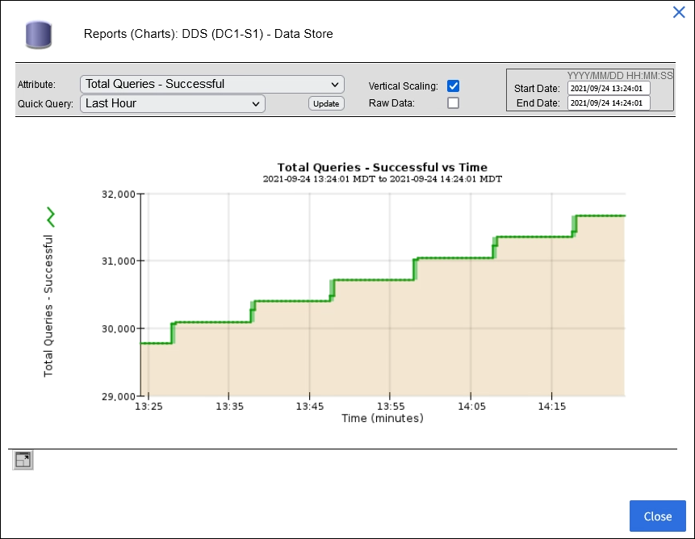

= チャートとグラフを使用します
:allow-uri-read: 
:icons: font
:imagesdir: ../media/

[role="lead"]
グラフやレポートを使用して、 StorageGRID システムの状態を監視し、問題のトラブルシューティングを行うことができます。

NOTE: Grid Managerはリリースごとに更新され、このページのスクリーンショットの例とは異なる場合があります。

== グラフのタイプ

グラフには、特定の StorageGRID 指標や属性の値がまとめて表示されます。

Grid Managerダッシュボードには、グリッドと各サイトで使用可能なストレージをまとめたカードが表示されます。

image::../media/dashboard_data_and_metadata_space_usage_breakdown.png[ダッシュボードのデータとメタデータスペースの使用状況の内訳]

Tenant Managerダッシュボードの[Storage usage]パネルには、次の情報が表示されます。

* テナントの最大バケット（ S3 ）またはコンテナ（ Swift ）のリスト
* 最大のバケットまたはコンテナの相対サイズを表す棒グラフ
* 使用済みスペースの合計。クォータが設定されている場合は、残りのスペースの量と割合

image::../media/tenant_dashboard_with_buckets.png[テナントダッシュボード]

また、 StorageGRID の指標や属性の変化を示すグラフは、 Nodes ページと * support * > * Tools * > * Grid Topology * ページからも見ることができます。

グラフには次の 4 種類があります。

* * Grafana チャート * ：ノードページで表示される、 Grafana チャートは、時間の経過に伴う Prometheus 指標の値のプロットに使用されます。たとえば、ストレージノードの * nodes * > * Network * タブには、ネットワークトラフィックに使用する Grafana チャートが含まれています。
+
image::../media/nodes_page_network_tab.png[[ ノード ] ページの [ ネットワーク ] タブ]

+

NOTE: Grafana チャートは、 * support * > * Tools * > * Metrics * ページで使用できる事前構築済みのダッシュボードにも含まれています。

* * 折れ線グラフ * ：ノードページおよび * support * > * Tools * > * Grid topology * ページ（グラフアイコンを選択）から選択できます image:../media/icon_chart_new_for_11_5.png["アイコンチャート（新規）"] データ値のあとに線グラフを使用して、単位値（ NTP 周波数オフセットの ppm など）を含む StorageGRID 属性の値がプロットされます。値の変化が時間の経過に合わせて一定の間隔でプロットされます。
+
image::../media/line_graph.gif[線グラフ（ Line Graph ）]

* * 面グラフ * ：ノードページおよび * サポート * > * ツール * > * グリッドトポロジ * ページ（グラフアイコンを選択）から使用できます image:../media/icon_chart_new_for_11_5.png["アイコンチャート（新規）"] データ値のあとに）オブジェクト数やサービスの負荷の値など、容量の属性値のプロットには面グラフが使用されます。面グラフは折れ線グラフに似ていますが、線の下の部分の背景が薄い茶色になります。値の変化が時間の経過に合わせて一定の間隔でプロットされます。
+
image::../media/area_graph.gif[面積グラフ（ Area Graph ）]

* グラフの中には、別の種類のグラフアイコンで示されるものもあります image:../media/icon_chart_new_for_11_5.png["グラフアイコン"] また、形式が異なります。
+
image::../media/charts_lost_object_detected.png[グラフに損失オブジェクトが検出されました]

* * 状態グラフ * ：サポート * > * ツール * > * グリッドトポロジ * ページで使用できます（グラフアイコンを選択します） image:../media/icon_chart_new_for_11_5.png["アイコンチャート（新規）"] データ値のあとに）状態グラフを使用して、オンライン、スタンバイ、オフラインのいずれかの状態を表す属性値がプロットされます。状態グラフは折れ線グラフに似ていますが、値が連続しておらず、別の状態に切り替わると値が飛んで表示されます。
+
image::../media/state_graph.gif[状態グラフ（ State Graph ）]

.関連情報
link:viewing-nodes-page.html["Nodes ページを表示します"]

link:viewing-grid-topology-tree.html["グリッドトポロジツリーを表示します"]

link:reviewing-support-metrics.html["サポート指標を確認"]

== グラフの凡例

グラフの描画に使用される線と色には特定の意味があります。

[cols="1a,3a"]
|===
| 例 | 意味 

 a| 
image:../media/dark_green_chart_line.gif["濃い緑の線を示すスクリーンショット"]
 a| 
レポートされる属性値は濃い緑の線でプロットされます。

 a| 
image:../media/light_green_chart_line.gif["データビンの背景を示すスクリーンショット"]
 a| 
濃い緑の線の周りの薄い緑の背景は、その時間範囲内の実際の値が変化し、より高速なプロットのために「バインド」されていることを示します。濃い線は加重平均を表し、薄い緑は最大値から最小値までの範囲を示します。薄い茶色の背景は面グラフで累計データを示すために使用されます。

 a| 
image:../media/no_data_plotted_chart.gif["プロット線の空白領域を示すスクリーンショット"]
 a| 
データがプロットされていない空白の部分は、属性値が使用できなかったことを示します。背景色は、属性をレポートするサービスの状態に応じて、青、グレー、またはグレーと青の中間色になります。

 a| 
image:../media/light_blue_chart_shading.gif["特定できない値を表す薄い青の背景を示すスクリーンショット"]
 a| 
薄い青の背景は、サービスの状態が不明なため属性値がレポートされず、一部またはすべての属性値を特定できなかった時間範囲を示します。

 a| 
image:../media/gray_chart_shading.gif["不明な値を表すグレーの背景を示すスクリーンショット"]
 a| 
グレーの背景は、属性をレポートするサービスが管理上の理由で停止しているために、一部またはすべての属性値を取得できなかった時間範囲を示します。

 a| 
image:../media/gray_blue_chart_shading.gif["特定できない値と不明な値が混在していることを示すスクリーンショット"]
 a| 
グレーと青の中間色の背景は、サービスの状態が不明なために属性値を特定できなかったか、属性をレポートするサービスが管理上の理由で停止しているために属性値を取得できなかった時間範囲を示します。

|===

== グラフとグラフを表示します

ノードページには、ストレージ容量やスループットなどの属性を監視するために定期的にアクセスする必要があるグラフとグラフが含まれています。一部のケース、特にテクニカルサポートと連携している場合は、サポート * > * ツール * > * グリッドトポロジ * ページを使用して他のチャートにアクセスできます。

.作業を開始する前に
を使用して Grid Manager にサインインする必要があります link:../admin/web-browser-requirements.html["サポートされている Web ブラウザ"]。

.手順
. [* nodes （ノード） ] を選択します次に、ノード、サイト、またはグリッド全体を選択します。
. 情報を表示するタブを選択します。
+
一部のタブには、 Prometheus 指標の値の経時的プロットに使用される 1 つ以上の Grafana チャートがあります。たとえば、ノードの * nodes * > * Hardware * タブには、 2 つの Grafana チャートがあります。

+
image::../media/nodes_page_hardware_tab_graphs.png[ノードページハードウェアタブグラフ]

. 必要に応じて、グラフにカーソルを合わせると、特定の時点の詳細な値が表示されます。
+
image::../media/nodes_page_memory_usage_details.png[Nodes ページメモリ使用状況の詳細]

. 必要に応じて、特定の属性や指標のグラフを表示することもできます。ノードページのテーブルで、グラフアイコンを選択します image:../media/icon_chart_new_for_11_5.png["グラフアイコン"] をクリックします。
+

NOTE: グラフは、すべての指標と属性で使用できるわけではありません。

+
* 例 1 * ：ストレージノードの [ オブジェクト ] タブで、グラフアイコンを選択できます image:../media/icon_chart_new_for_11_5.png["グラフアイコン"] ストレージノードに対して成功したメタデータストアクエリの合計数を確認できます。

+

+
image::../media/nodes_page-objects_chart_successful_metadata_queries.png[成功したメタデータクエリをグラフ化します]

+
*例2 *：ストレージノードの[Objects]タブで、グラフアイコン image:../media/icon_chart_new_for_11_5.png["グラフアイコン"] 一定の期間に検出された損失オブジェクトの数の Grafana グラフを確認する場合。

+
image::../media/object_count_table.png[オブジェクト数テーブル]

+
image::../media/charts_lost_object_detected.png[グラフに損失オブジェクトが検出されました]

. [ノード]ページに表示されていない属性のグラフを表示するには、* support *>* Tools *>* Grid topology *を選択します。
. *_grid node_*>*_component または SERVICE_*>* Overview *>* Main * を選択します。
+
image::../media/nms_chart.gif[説明が付随するスクリーンショット]

. グラフアイコンを選択します image:../media/icon_chart_new_for_11_5.png["グラフアイコン"] をクリックします。
+
表示は自動的に * Reports * > * Charts * ページに変わります。このグラフには、過去 1 日間の属性のデータが表示されます。

== グラフを生成します

グラフには、属性データ値がグラフィカルな形式で表示されます。データセンターサイト、グリッドノード、コンポーネント、またはサービスについてのレポートを作成できます。

.作業を開始する前に
* を使用して Grid Manager にサインインする必要があります link:../admin/web-browser-requirements.html["サポートされている Web ブラウザ"]。
* これで完了です link:../admin/admin-group-permissions.html["特定のアクセス権限"]。

.手順
. サポート * > * ツール * > * グリッドトポロジ * を選択します。
. *_grid node_*>*_component または SERVICE_*>* Reports *>* Charts * を選択します。
. [* 属性 * （ * Attribute * ） ] ドロップダウンリストからレポートする属性を選択します。
. Y軸を強制的にゼロから開始するには、*垂直スケーリング*チェックボックスをオフにします。
. 正確な値を表示するには、*[Raw Data]*チェックボックスをオンにします。値を小数点以下3桁までに丸めるには（割合でレポートされる属性など）、*[Raw Data]*チェックボックスをオフにします。
. [*Quick Query] ドロップダウン・リストから、レポートする期間を選択します。
+
カスタムクエリオプションを選択して、特定の期間を選択します。

+
グラフが表示されるまでに少し時間がかかります。期間が長い場合は集計に数分かかることもあります。

. [ カスタムクエリ ] を選択した場合は、 [ 開始日 ] と [ 終了日 ] を入力してグラフの期間をカスタマイズします。
+
の形式を使用します `_YYYY/MM/DDHH:MM:SS_` 現地時間。この形式に一致するには、先頭にゼロを補う必要があります。たとえば、「 2017/4/6 7 ： 30 ： 00 」と入力すると検証に失敗します。正しい形式は「 2017/04/06 07 ： 30 ： 00 」です。

. 「 * Update * 」を選択します。
+
グラフは数秒後に生成されます。期間が長い場合は集計に数分かかることもあります。クエリで設定した時間の長さに応じて、フルレポートか要約レポートのいずれかが表示されます。

