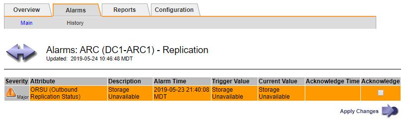

= 従来のアラームを表示します
:allow-uri-read: 
:icons: font
:imagesdir: ../media/

[role="lead"]
システム属性がアラームのしきい値に達すると、アラーム（従来のシステム）がトリガーされます。現在アクティブなアラームは、 Current Alarms ページから表示できます。

NOTE: 従来のアラームシステムは引き続きサポートされますが、アラートシステムには大きなメリットがあり、使いやすくなっています。

.作業を開始する前に
* を使用して Grid Manager にサインインする必要があります link:../admin/web-browser-requirements.html["サポートされている Web ブラウザ"]。

.手順
. *support*>* Alarms （レガシー） *>* Current alarms * を選択します。
+
image::../media/current_alarms_page.png[Current Alarms ページ]

+
アラームアイコンは、各アラームの重大度を次のように示します。

+
[cols="1a,1a,1a,3a"]
|===
| をクリックします。 | 色（ Color ） | アラームの重大度 | 意味 

 a| 
image:../media/icon_alarm_yellow_notice.gif["黄色の四角形のアイコン"]
 a| 
黄色
 a| 
注意
 a| 
ノードはグリッドに接続されていますが、正常な状態ではありません。通常の動作に影響はありません。

 a| 
image:../media/icon_alert_yellow_minor.png["薄いオレンジの菱形のアイコン"]
 a| 
薄いオレンジ
 a| 
マイナー
 a| 
ノードはグリッドに接続されていますが、正常な状態ではありません。将来的に動作に影響する可能性があります。さらに重大な問題にならないように調査が必要です。

 a| 
image:../media/icon_alert_orange_major.png["濃いオレンジの菱形のアイコン"]
 a| 
濃いオレンジ
 a| 
メジャー（ Major ）
 a| 
ノードはグリッドに接続されていますが、正常な状態ではありません。すでに動作に影響が及んでいます。エスカレーションを防ぐために早急な対応が必要です。

 a| 
image:../media/icon_alert_red_critical.png["赤の x 印のアイコン"]
 a| 
赤
 a| 
重要
 a| 
ノードはグリッドに接続されていますが、正常な状態ではありません。正常に動作しなくなっています。問題 にはすぐに対処する必要があります。

|===
. アラームをトリガーした原因となった属性を確認するには、テーブルで属性名を右クリックします。
. アラームのその他の詳細情報を表示するには、テーブルでサービス名をクリックします。
+
選択したサービスの Alarms タブが表示されます（ * support * > * Tools * > * Grid topology * > * _Grid Node_* > * _Service_* > * Alarms * ）。

+

. 現在のアラームの数を消去するには、必要に応じて次の操作を行います。
+
** アラームを確認します。確認済みのアラームは、重大度レベルが次のレベルでトリガーされるか、解決されてから再度発生するまで、レガシーアラームの数に含まれなくなります。
** システム全体で特定のデフォルトアラームまたはグローバルカスタムアラームを無効にして、再度トリガーされないようにします。

.関連情報
link:alarms-reference.html["アラーム一覧（従来のシステム）"]

link:managing-alarms.html["現在のアラーム（従来のシステム）に確認応答する"]

link:managing-alarms.html["アラームの無効化（従来のシステム）"]
