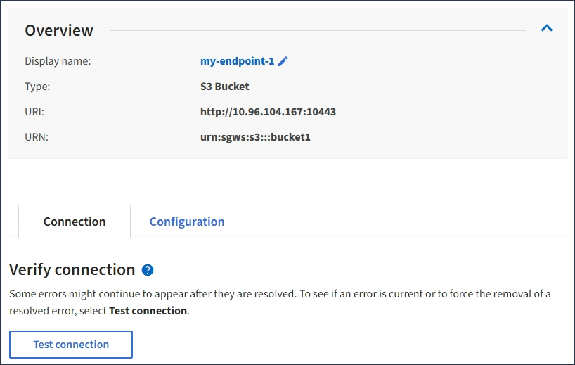

= プラットフォームサービスエンドポイントの接続をテストします
:allow-uri-read: 
:icons: font
:imagesdir: ../media/

[role="lead"]
プラットフォームサービスへの接続が変更された場合は、エンドポイントへの接続をテストして、デスティネーションリソースが存在すること、および指定したクレデンシャルでアクセスできることを確認できます。

.作業を開始する前に
* Tenant Manager にはを使用してサインインします link:../admin/web-browser-requirements.html["サポートされている Web ブラウザ"]。
* が設定されたユーザグループに属している必要があります link:tenant-management-permissions.html["エンドポイントまたはRoot Access権限を管理します"]。

.このタスクについて
StorageGRID は、クレデンシャルに正しい権限があるかどうかを検証しません。

.手順
. ストレージ（ S3 ） * > * プラットフォームサービスのエンドポイント * を選択します。
+
Platform services Endpoints ページが表示され、設定済みのプラットフォームサービスエンドポイントのリストが表示されます。

+
image::../media/endpoints_list.png[エンドポイントリスト]

. 接続をテストするエンドポイントを選択します。
+
エンドポイントの詳細ページが表示されます。

+

. [ 接続のテスト * ] を選択します。
+
** 指定したクレデンシャルを使用してエンドポイントにアクセスできた場合は、成功を伝えるメッセージが表示されます。エンドポイントへの接続は、各サイトの 1 つのノードから検証されます。
** エンドポイントの検証が失敗した場合は、エラーメッセージが表示されます。エラーを修正するためにエンドポイントを変更する必要がある場合は、「 * Configuration * 」を選択して情報を更新します。次に、 [ テスト ] を選択し、変更を保存します。 *

