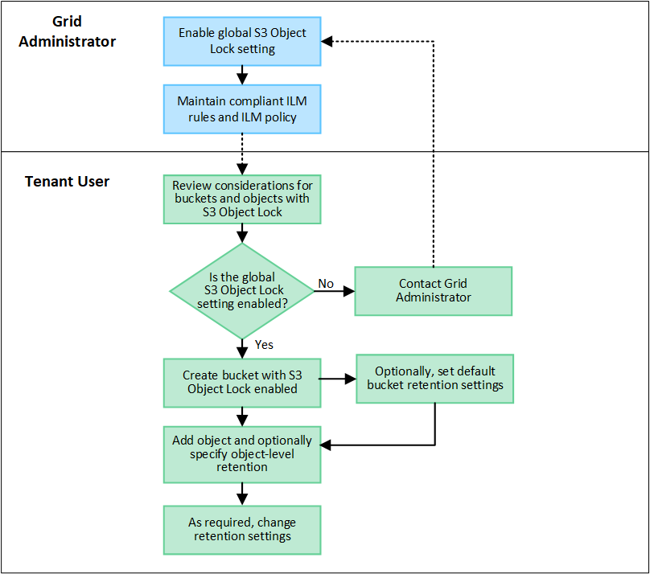

= S3オブジェクトロックを使用してオブジェクトを保持します
:allow-uri-read: 
:icons: font
:imagesdir: ../media/

[role="lead"]
バケットとオブジェクトが保持に関する規制要件に準拠する必要がある場合は、S3オブジェクトロックを使用できます。

== S3 オブジェクトのロックとは何ですか？

StorageGRID S3 オブジェクトロック機能は、 Amazon Simple Storage Service （ Amazon S3 ）での S3 オブジェクトロックに相当するオブジェクト保護解決策 です。

図に示すように、 StorageGRID システムでグローバルな S3 オブジェクトのロック設定が有効になっている場合、 S3 テナントアカウントでは、 S3 オブジェクトのロックを有効にしているかどうかに関係なくバケットを作成できます。バケットでS3オブジェクトロックが有効になっている場合は、バケットのバージョン管理が必要であり、自動的に有効になります。

バケットでS3オブジェクトロックが有効になっている場合、S3クライアントアプリケーションは、そのバケットに保存されているすべてのオブジェクトバージョンの保持設定をオプションで指定できます。

また、S3オブジェクトロックが有効になっているバケットでは、オプションでデフォルトの保持モードと保持期間を設定できます。デフォルトの設定は、独自の保持設定がない状態でバケットに追加されたオブジェクトにのみ適用されます。

image::../media/s3_object_lock_architecture.png[S3 オブジェクトロックアーキテクチャ]

=== 保持モード

StorageGRID S3オブジェクトロック機能は、2つの保持モードをサポートしており、さまざまなレベルの保護をオブジェクトに適用できます。これらのモードは、Amazon S3の保持モードに相当します。

* コンプライアンスモードの場合：
+
** retain-until-dateに達するまで、オブジェクトを削除できません。
** オブジェクトのretain-until-dateは増やすことはできますが、減らすことはできません。
** オブジェクトのretain-until-dateは、その日付に達するまで削除できません。

* ガバナンスモードの場合：
+
** 特別な権限を持つユーザは、要求でバイパスヘッダーを使用して、特定の保持設定を変更できます。
** これらのユーザは、retain-until-dateに達する前にオブジェクトバージョンを削除できます。
** これらのユーザは、オブジェクトのretain-until-dateを増減、または削除できます。

=== オブジェクトバージョンの保持設定

S3オブジェクトロックを有効にしてバケットを作成した場合、ユーザはS3クライアントアプリケーションを使用して、バケットに追加される各オブジェクトに次の保持設定を必要に応じて指定できます。

* *保持モード*：コンプライアンスまたはガバナンスのいずれか。
* * Retain-until-date *：オブジェクトバージョンのretain-until-dateが将来の日付の場合、オブジェクトは読み出すことはできますが、削除することはできません。
* * リーガルホールド * ：オブジェクトバージョンにリーガルホールドを適用すると、そのオブジェクトがただちにロックされます。たとえば、調査または法的紛争に関連するオブジェクトにリーガルホールドを設定する必要がある場合があります。リーガルホールドには有効期限はありませんが、明示的に削除されるまで保持されます。リーガルホールドは、それまでの保持期間とは関係ありません。
+

NOTE: オブジェクトがリーガルホールドの対象である場合、保持モードに関係なく、誰もオブジェクトを削除できません。

+
オブジェクト設定の詳細については、を参照してください link:../s3/use-s3-api-for-s3-object-lock.html["S3 REST APIを使用してS3オブジェクトロックを設定します"]。

=== バケットのデフォルトの保持設定

S3オブジェクトロックを有効にしてバケットを作成した場合は、必要に応じて次のバケットのデフォルト設定を指定できます。

* *デフォルトの保持モード*：コンプライアンスまたはガバナンスのいずれか。
* *デフォルトの保持期間*：このバケットに追加された新しいオブジェクトバージョンを、追加された日から保持する期間。

デフォルトのバケット設定は、独自の保持設定がない新しいオブジェクトにのみ適用されます。これらのデフォルト設定を追加または変更しても、既存のバケットオブジェクトには影響しません。

を参照してください link:../tenant/creating-s3-bucket.html["S3 バケットを作成します。"] および link:../tenant/update-default-retention-settings.html["S3オブジェクトロックのデフォルトの保持期間を更新します"]。

== S3 オブジェクトロックのワークフロー

次のワークフロー図は、 StorageGRID で S3 オブジェクトロック機能を使用する場合の大まかな手順を示しています。

S3 オブジェクトのロックを有効にしてバケットを作成する前に、グリッド管理者が StorageGRID システム全体に対してグローバルな S3 オブジェクトのロック設定を有効にする必要があります。グリッド管理者は、情報ライフサイクル管理（ILM）ポリシーが「準拠」であることを確認し、S3オブジェクトロックが有効なバケットの要件を満たしている必要もあります。詳細については、グリッド管理者に問い合わせるか、の手順を参照してください link:../ilm/managing-objects-with-s3-object-lock.html["S3オブジェクトロックを使用してオブジェクトを管理します"]。

S3オブジェクトロックのグローバル設定を有効にしたら、S3オブジェクトロックを有効にしてバケットを作成し、必要に応じて各バケットにデフォルトの保持設定を指定できます。また、S3クライアントアプリケーションを使用して、必要に応じてオブジェクトバージョンごとに保持設定を指定できます。

== S3 オブジェクトのロックを有効にした場合のバケットの要件

* StorageGRID システムでグローバルな S3 オブジェクトロック設定が有効になっている場合は、テナントマネージャ、テナント管理 API 、または S3 REST API を使用して、 S3 オブジェクトロックを有効にしたバケットを作成できます。
* S3 オブジェクトのロックを使用する場合は、バケットの作成時に S3 オブジェクトのロックを有効にする必要があります。既存のバケットでS3オブジェクトロックを有効にすることはできません。
* バケットで S3 オブジェクトのロックが有効になっている場合は、そのバケットのバージョン管理が StorageGRID で自動的に有効になります。バケットのS3オブジェクトロックを無効にしたり、バージョン管理を一時停止したりすることはできません。
* 必要に応じて、Tenant Manager、テナント管理API、またはS3 REST APIを使用して、各バケットのデフォルトの保持モードと保持期間を指定できます。バケットのデフォルトの保持設定は、バケットに追加された新しいオブジェクトのうち、独自の保持設定がないオブジェクトにのみ適用されます。これらのデフォルト設定は、アップロード時にオブジェクトバージョンごとに保持モードとretain-until-dateを指定することで上書きできます。
* バケットライフサイクル設定は、S3オブジェクトロックが有効なバケットでサポートされます。
* CloudMirror レプリケーションは、 S3 オブジェクトロックが有効になっているバケットではサポートされません。

== S3 オブジェクトのロックが有効になっているバケット内のオブジェクトの要件

* オブジェクトバージョンを保護するには、バケットのデフォルトの保持設定を指定するか、オブジェクトバージョンごとに保持設定を指定します。オブジェクトレベルの保持設定は、S3クライアントアプリケーションまたはS3 REST APIを使用して指定できます。
* 保持設定はオブジェクトのバージョンごとに適用されます。オブジェクトバージョンには、 retain-until date 設定とリーガルホールド設定の両方を設定できます。ただし、オブジェクトバージョンを保持することはできません。また、どちらも保持することはできません。オブジェクトの retain-une-date 設定またはリーガルホールド設定を指定すると、要求で指定されたバージョンのみが保護されます。オブジェクトの以前のバージョンはロックされたまま、オブジェクトの新しいバージョンを作成できます。

== S3 オブジェクトのロックが有効なバケット内のオブジェクトのライフサイクル

S3オブジェクトロックが有効なバケットに保存された各オブジェクトは、次の段階を経ます。

. * オブジェクトの取り込み *
+
S3オブジェクトロックが有効になっているバケットにオブジェクトバージョンを追加すると、保持設定は次のように適用されます。

+
** オブジェクトに保持設定が指定されている場合は、オブジェクトレベルの設定が適用されます。デフォルトのバケット設定は無視されます。
** オブジェクトに保持設定が指定されていない場合は、デフォルトのバケット設定が適用されます（存在する場合）。
** オブジェクトまたはバケットに保持設定が指定されていない場合、オブジェクトはS3オブジェクトロックによって保護されません。

+
保持設定が適用されている場合は、オブジェクトとS3ユーザ定義メタデータの両方が保護されます。

. *オブジェクトの保持と削除*
+
指定した保持期間中、各保護オブジェクトの複数のコピーがStorageGRID によって格納されます。オブジェクトコピーの正確な数、タイプ、格納場所は、アクティブなILMポリシーの準拠ルールによって決まります。retain-until-dateに達する前に保護オブジェクトを削除できるかどうかは、保持モードによって異なります。

+
** オブジェクトがリーガルホールドの対象である場合、保持モードに関係なく、誰もオブジェクトを削除できません。

== 従来の準拠バケットは引き続き管理できますか。

S3 オブジェクトロック機能は、以前のバージョンの StorageGRID で使用されていた準拠機能に代わる機能です。以前のバージョンの StorageGRID を使用して準拠バケットを作成した場合は、引き続きこれらのバケットの設定を管理できますが、新しい準拠バケットは作成できなくなります。手順については、を参照してください
https://kb.netapp.com/Advice_and_Troubleshooting/Hybrid_Cloud_Infrastructure/StorageGRID/How_to_manage_legacy_Compliant_buckets_in_StorageGRID_11.5["ネットアップのナレッジベース： StorageGRID 11.5 でレガシー準拠バケットを管理する方法"^]。
