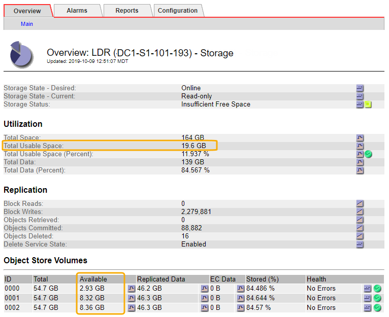

= Storage Status （ SSTS ）アラームをトラブルシューティングします
:allow-uri-read: 
:icons: font
:imagesdir: ../media/

[role="lead"]
Storage Status （ SSTS ）アラームは、ストレージノードにオブジェクトストレージ用の十分な空きスペースが残っていない場合にトリガーされます。

.作業を開始する前に
* を使用して Grid Manager にサインインする必要があります link:../admin/web-browser-requirements.html["サポートされている Web ブラウザ"]。
* これで完了です link:../admin/admin-group-permissions.html["特定のアクセス権限"]。

.このタスクについて
ストレージノード内のすべてのボリュームの空きスペース量が Storage Volume Soft Read Only Watermark （ * configuration * > * System * > * Storage options * ）の値を下回ると、 SSTS （ Storage Status ）アラームが Notice レベルでトリガーされます。

image::../media/storage_watermarks.png[ストレージオプションの概要]

たとえば、 Storage Volume Soft Read-Only Watermark がデフォルト値の 10GB に設定されているとします。ストレージノード内の各ストレージボリュームに残っている使用可能スペースが 10GB 未満になると、 SSTS アラームがトリガーされます。いずれかのボリュームに 10GB 以上の空き容量があれば、アラームはトリガーされません。

SSTS アラームがトリガーされた場合は、次の手順を実行して問題 を詳しく把握する必要があります。

.手順
. *support*>* Alarms （レガシー） *>* Current alarms * を選択します。
. Service 列で、 SSTS アラームに関連付けられているデータセンター、ノード、およびサービスを選択します。
+
Grid Topology ページが表示されます。Alarms タブには、選択したノードおよびサービスのアクティブなアラームが表示されます。

+
image::../media/ssts_alarm.png[Storage Node > LDR > Storage > Alarms タブの順にクリックします]

+
この例では、 SSTS （ Storage Status ）アラームと SAVP （ Total Usable Space （ Percent ））アラームの両方が Notice レベルでトリガーされています。

+

NOTE: 通常は、 SSTS アラームと SAVP アラームの両方がほぼ同時にトリガーされます。ただし、両方のアラームがどちらトリガーされるかはウォーターマークの設定（ GB ）と SAVP アラームの設定で決まります。

. 実際に使用可能なスペース量を確認するには、 *ldr*>*Storage*>*Overview* を選択し、 Total Usable Space （ STAS ）属性を検索します。
+

+
この例のストレージノードでは、 164GB 中 19.6GB しか使用可能なスペースが残っていません。合計は 3 つのオブジェクトストアボリュームの「使用可能な」 * 値の合計です。3 つのストレージボリュームのそれぞれに 10GB 未満の空きスペースがあったため、 SSTS アラームがトリガーされました。

. 一定期間にわたるストレージの使用状況を確認するには、 * Reports * タブを選択し、過去数時間の Total Usable Space のプロットを使用します。
+
この例では、 12 ： 00 の時点の使用可能な合計スペースは約 155 GB でしたが、 12 ： 35 には 20 GB まで減り、その時点で SSTS アラームがトリガーされています。

+
image::../media/total_usable_space_chart.png[Total Usable Space - グラフ]

. 合計容量の割合としてストレージがどのように使用されているかを確認するには、過去数時間の合計使用可能スペース（割合）をプロットします。
+
この例では、ほぼ同じタイミングで使用可能な合計スペースが 95% から 10% 強に減少しています。

+
image::../media/total_usable_storage_percent_chart.png[Total Usable Space （ Percent ） - グラフ]

. 必要に応じて、 link:../expand/guidelines-for-adding-object-capacity.html["ストレージ容量を追加"]。
+
も参照してください link:../admin/managing-full-storage-nodes.html["ストレージノードがいっぱいになったときの管理"]。

